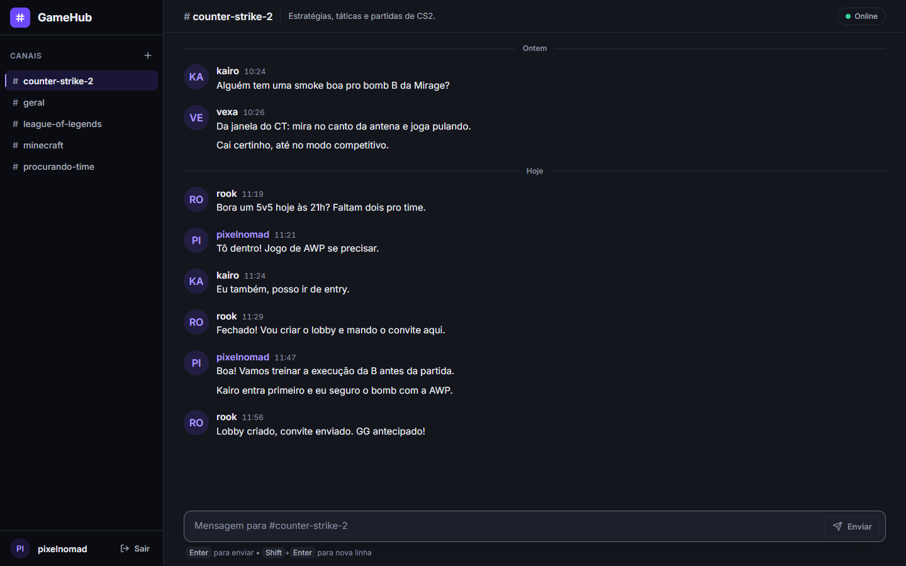
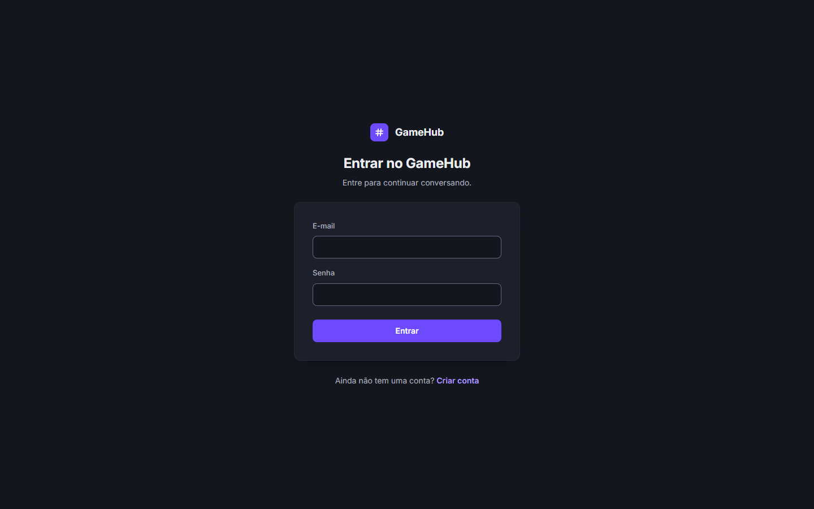
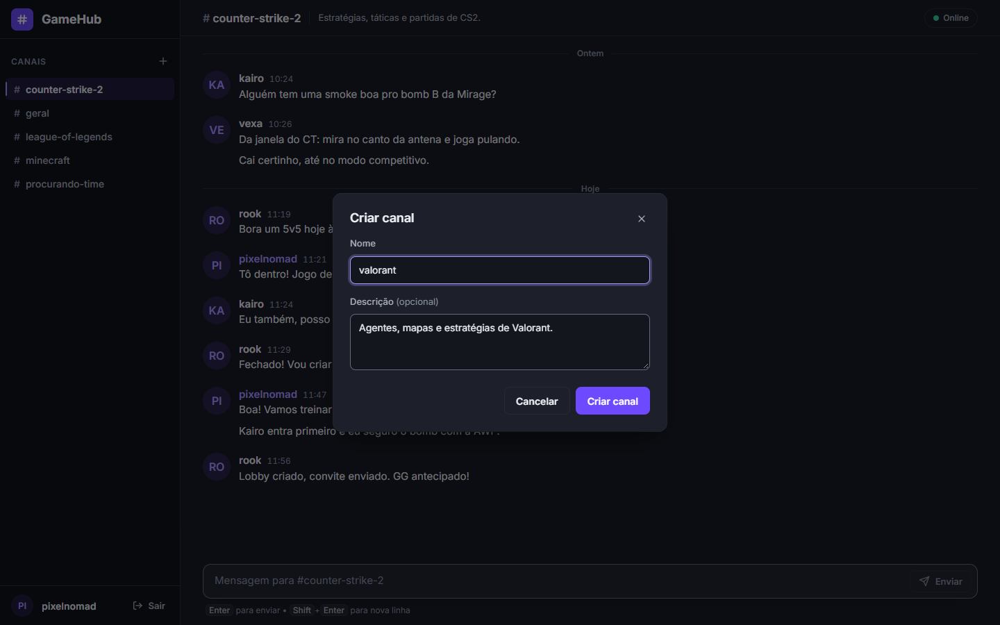
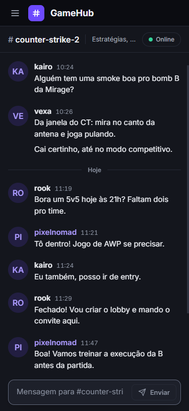

# GameHub

[](https://github.com/luizsoc/GameHub/actions/workflows/ci.yml)

**Chat em tempo real para comunidades de jogadores**, com canais públicos e
privados, mensagens diretas, histórico persistente e mensagens entregues na
hora a todos que estão na conversa. Aplicação
full stack que demonstra comunicação em tempo real autenticada de ponta a
ponta: ASP.NET Core (.NET 10) com SignalR e PostgreSQL no backend, React +
TypeScript no frontend.



<p align="center"><sub>Chat no desktop: mensagens agrupadas por autor, separadores de data e status da conexão em tempo real.</sub></p>

**Stack:** .NET 10 · ASP.NET Core · SignalR · Entity Framework Core ·
PostgreSQL · React 19 · TypeScript · Vite · Docker · GitHub Actions

### Destaques

- **Tempo real autenticado:** o mesmo JWT protege a API REST e a conexão
  SignalR; as mensagens são transmitidas por grupo de canal, com reconexão
  automática e reentrada no canal.
- **Canais privados e mensagens diretas:** acesso por membro aplicado no
  backend, na REST e no SignalR (conhecer o id não basta); mensagens diretas
  sem duplicidade, mesmo com chamadas simultâneas.
- **Clean Architecture:** backend em quatro projetos (Domain, Application,
  Infrastructure, Api), com EF Core, PostgreSQL e migrations explícitas.
- **Testes e CI:** 100 testes automatizados (xUnit) e GitHub Actions a cada
  push e pull request na `master` (build e testes do backend; lint e build do
  frontend).
- **Sobe com Docker Compose:** PostgreSQL, migrations e API com healthcheck,
  sem nenhum segredo no repositório (o frontend roda com o Vite).
- **Preparado para produção:** rate limiting no login e cadastro, validação de
  limites, `AllowedHosts`, forwarded headers para reverse proxy e CSP validada.
- **Interface própria:** design system sem biblioteca de componentes,
  responsiva (menu lateral no mobile) e acessível.

**[Como executar](#execução-com-docker)** · **[Arquitetura](#arquitetura)** ·
**[Testes](#testes)** · **[Decisões técnicas](#principais-decisões-técnicas)** ·
**[Limitações](#limitações-e-melhorias-futuras)**

---

## Funcionalidades

**Contas e sessão**

- Cadastro com nome de usuário e e-mail únicos (o e-mail é normalizado para
  minúsculas) e login que retorna um JWT válido por 2 horas.
- Sessão restaurada ao recarregar a página; quando o token expira, o usuário
  volta ao login com o aviso "Sua sessão expirou".
- Rotas protegidas e logout.

**Canais**

- Lista de canais em ordem alfabética e criação de canal com nome único e
  descrição opcional (nome duplicado retorna "Já existe um canal com esse
  nome.").
- Canais públicos (abertos a todos os usuários) e **canais privados**: só os
  membros veem o canal, leem o histórico e enviam mensagens. Quem cria um canal
  privado vira membro automaticamente, e qualquer membro pode adicionar outras
  pessoas pelo nome de usuário. Canais privados aparecem com um cadeado.
- Canais criados pelos usuários não podem começar com `dm:` (prefixo reservado
  às mensagens diretas).

**Mensagens diretas**

- Conversa privada entre duas pessoas: "Nova mensagem" busca o usuário pelo
  nome (busca parcial, sem diferenciar maiúsculas) e abre a conversa existente
  ou cria uma nova. Nunca existem duas conversas entre o mesmo par.
- Seção "Mensagens diretas" na barra lateral, carregada do backend, com o nome
  e o avatar da outra pessoa. Uma conversa nova aparece para os dois
  participantes na hora, sem recarregar a página.
- O histórico, o envio e o tempo real são os mesmos dos canais.

**Mensagens**

- Histórico completo do canal carregado via REST, em ordem cronológica.
- Envio e recebimento em tempo real via SignalR, sem duplicar mensagens.
- Mensagens seguidas do mesmo usuário, dentro de 5 minutos, agrupadas
  visualmente; avatar com iniciais; separadores de data ("Hoje", "Ontem",
  data completa); horário `HH:mm` com data completa no tooltip.
- Campo de mensagem com Enter para enviar e Shift+Enter para nova linha, limite
  de 2000 caracteres e contador a partir de 1800.
- Rolagem automática apenas quando o usuário já está no fim da conversa.

**Conexão**

- Indicador de estado: Online, Conectando, Reconectando e Offline.
- Reconexão automática, com reentrada no canal atual, e avisos acima do campo de
  mensagem enquanto a conexão não está disponível.

**Interface**

- Tema escuro, layout desktop com barra lateral fixa e, abaixo de 768px, menu
  lateral (drawer) com botão de abrir e fechar.
- Estados de carregamento (skeleton), vazio e erro com "Tentar novamente".
- Acessibilidade: navegação por teclado, foco visível, rótulos e mensagens de
  erro associados aos campos, `role="log"` na conversa e respeito a
  `prefers-reduced-motion`.

---

## Telas

| Login | Criar canal |
| :---: | :---: |
|  |  |
| Entrada com e-mail e senha. | Novo canal com nome e descrição opcional. |

<p align="center">
  
</p>

<p align="center"><sub>Mobile (375×812): barra superior com menu lateral, conversa e campo de mensagem.</sub></p>

---

## Stack tecnológica

| Camada | Tecnologias |
| ------ | ----------- |
| Backend | .NET 10, ASP.NET Core (Web API), SignalR, Entity Framework Core 10, Npgsql, JWT Bearer (HS256), `PasswordHasher` do ASP.NET Core Identity |
| Banco de dados | PostgreSQL 17 (imagem Docker `postgres:17`) |
| Frontend | React 19, TypeScript, Vite 8, React Router 7, Axios, `@microsoft/signalr`, Oxlint |
| Testes | xUnit, Moq, FluentAssertions, WebApplicationFactory + SQLite (integração) |
| Infraestrutura | Docker, Docker Compose, EF Core migrations bundle, GitHub Actions (CI) |

O frontend não usa biblioteca de componentes: o design system (tokens de cor,
espaçamento e tipografia) e os ícones SVG são próprios. A fonte Inter é
carregada do Google Fonts.

---

## Arquitetura

O backend segue Clean Architecture, com dependências apontando para o domínio:

```
GameHub.Api  ──►  GameHub.Application  ──►  GameHub.Domain
     │                    ▲
     └──►  GameHub.Infrastructure ──┘
```

| Projeto | Responsabilidade |
| ------- | ---------------- |
| `GameHub.Domain` | Entidades: `User`, `Channel`, `Message`, `ChannelMember`. |
| `GameHub.Application` | Serviços (`AuthService`, `ChannelService`, `DirectMessageService`, `MessageService`, `UserService`), DTOs e interfaces (repositórios, JWT, hash de senha, unit of work). |
| `GameHub.Infrastructure` | `GameHubDbContext` (EF Core + PostgreSQL), repositórios, migrations, `JwtService` e hash de senha. |
| `GameHub.Api` | Controllers REST, `ChatHub` (SignalR), autenticação e configuração em `Program.cs`. |

O frontend é uma SPA que usa REST para dados (canais, mensagens diretas,
busca de usuários, histórico, autenticação) e SignalR para as mensagens em
tempo real e o aviso de mensagens diretas novas.

### API REST

Todas as rotas, exceto as de autenticação e de saúde, exigem `Authorization: Bearer <token>`.

| Método | Rota | Descrição |
| ------ | ---- | --------- |
| `POST` | `/api/auth/register` | Cadastro (409 se nome de usuário ou e-mail já existem). Limitado por IP (429). |
| `POST` | `/api/auth/login` | Login; retorna `{ token }` (401 com credenciais inválidas). Limitado por IP (429). |
| `GET` | `/api/channels` | Lista, em ordem alfabética, os canais públicos e os privados de que o usuário é membro (sem as mensagens diretas). |
| `GET` | `/api/channels/{id}` | Detalhe de um canal (404 se não existe ou se é privado e o usuário não é membro). |
| `POST` | `/api/channels` | Cria um canal; `isPrivate` opcional (padrão público). 409 se o nome já existe. |
| `POST` | `/api/channels/{id}/members` | Adiciona um usuário (`{ username }`) a um canal privado. Só membros: 404 para quem não tem acesso ou para usuário inexistente, 409 se já é membro, 400 em canal público ou mensagem direta. |
| `GET` | `/api/users/search?username=` | Até 10 outros usuários cujo nome contém o termo, só com `id` e `username` (400 com termo vazio ou longo demais). |
| `GET` | `/api/direct-messages` | Mensagens diretas do usuário, cada uma com a outra pessoa (`userId`, `username`). |
| `POST` | `/api/direct-messages` | Abre a conversa com outro usuário (`{ userId }`): 200 com a existente ou 201 quando cria. 400 consigo mesmo, 404 usuário inexistente. O histórico e o envio usam as rotas de mensagens com o `id` da conversa. |
| `GET` | `/api/messages/channel/{channelId}` | Histórico do canal (404 se o usuário não tem acesso). |
| `POST` | `/api/messages` | Salva uma mensagem (404 se o usuário não tem acesso; não é transmitida em tempo real, o frontend envia pelo hub). |
| `GET` | `/health` | Liveness: o processo responde (`Healthy`). Anônimo. |
| `GET` | `/health/ready` | Readiness: a API também alcança o PostgreSQL (200 ou 503). Anônimo. |

Valores acima dos limites do banco (nome de usuário 50, e-mail 255, nome de
canal 100, descrição 500, mensagem 2000 caracteres) retornam 400 com
`{ message }`, em vez de erro 500.

---

## Execução com Docker

O Docker Compose sobe o **PostgreSQL** e o **backend (API + SignalR)**. O
**frontend continua rodando localmente com o Vite**, cujo proxy encaminha
`/api` e `/hubs` para o backend em Docker.

Pré-requisitos: Docker (com Compose) e Node.js `^20.19.0` ou `>=22.12.0`.

```bash
# 1. Segredos locais (o .env não é versionado)
cp .env.example .env

# 2. Gere uma chave e coloque-a em JWT_KEY no .env
node -e "console.log(require('crypto').randomBytes(48).toString('base64'))"

# 3. PostgreSQL + migrations + backend (http://localhost:5116)
docker compose up -d --build

# 4. Frontend (http://localhost:5173), em outro terminal
cd frontend
npm install
npm run dev
```

| Serviço | O que faz |
| ------- | --------- |
| `postgres` | PostgreSQL 17 com healthcheck (`pg_isready`) e dados no volume `gamehub_postgres_data`. Porta publicada apenas em `127.0.0.1:5432`, para o fluxo local sem Docker. |
| `migrate` | Aguarda o banco ficar saudável, aplica as migrations pendentes e encerra. |
| `api` | Sobe só depois que o `migrate` termina com sucesso. Acessa o banco pelo nome do serviço (`postgres`), roda como `Production` com usuário sem privilégios e é publicado em `127.0.0.1:5116`. Healthcheck em `/health/ready` (API + banco). |

Comandos úteis:

```bash
docker compose ps               # estado dos serviços
docker compose logs -f api      # logs do backend
docker compose down             # para e remove os containers (mantém os dados)
docker compose down -v          # também apaga o volume do banco
```

Sem `JWT_KEY` no `.env`, o `migrate` falha com a mensagem da aplicação e o
`api` não sobe.

Para produção, veja [Preparação para produção](#preparação-para-produção).

---

## Execução local

Backend com `dotnet run`, usando o **PostgreSQL do Docker**, e frontend com o
Vite.

Pré-requisitos: .NET 10 SDK, Node.js `^20.19.0` ou `>=22.12.0`, Docker e a
ferramenta `dotnet-ef`:

```bash
dotnet tool install --global dotnet-ef
```

```bash
# 1. Somente o banco de dados (credenciais locais de desenvolvimento)
docker compose up -d postgres

# 2. Chave JWT de desenvolvimento, fora do repositório (User Secrets)
dotnet user-secrets set "Jwt:Key" "$(node -e "console.log(require('crypto').randomBytes(48).toString('base64'))")" --project backend/GameHub.Api

# 3. Migrations
dotnet ef database update --project backend/GameHub.Infrastructure --startup-project backend/GameHub.Api

# 4. Backend (http://localhost:5116, ambiente Development)
dotnet run --project backend/GameHub.Api --launch-profile http

# 5. Frontend (http://localhost:5173), em outro terminal
cd frontend
npm install
npm run dev
```

O backend local e o `api` do Docker usam a mesma porta (5116): rode um de cada
vez (`docker compose stop api`).

Scripts do frontend:

| Script | Descrição |
| ------ | --------- |
| `npm run dev` | Servidor de desenvolvimento (proxy `/api` e `/hubs` → `http://localhost:5116`) |
| `npm run build` | Checagem de tipos (`tsc -b`) + build de produção |
| `npm run lint` | Oxlint |
| `npm run preview` | Serve o build de produção localmente, com o mesmo proxy |

---

## Testes

```bash
# Backend: testes automatizados (xUnit)
dotnet test GameHub.slnx

# Frontend: lint + checagem de tipos e build
cd frontend
npm run lint
npm run build
```

No GitHub Actions ([`ci.yml`](.github/workflows/ci.yml)), os mesmos checks
rodam a cada push e pull request na `master`: restore, build e testes do
backend; `npm ci`, lint e build do frontend.

O backend tem 100 testes em `backend/GameHub.Tests`:

| Arquivo | Testes | O que cobre |
| ------- | ------ | ----------- |
| `Services/AuthServiceTests.cs` | 12 | Cadastro e login: campos vazios, nome de usuário longo demais, nome de usuário ou e-mail duplicado, e-mail inexistente e senha incorreta. |
| `Services/MessageServiceTests.cs` | 11 | Envio (incluindo remoção de espaços nas pontas, conteúdo vazio ou longo demais, canal ou usuário inexistente) e histórico; nada é lido ou gravado em canal sem acesso. |
| `Services/ChannelServiceTests.cs` | 19 | Criação (incluindo nome vazio, duplicado, longo demais ou com o prefixo `dm:`, descrição longa demais e o criador como membro de um canal privado), listagem, busca por id e adição de membros (sucesso, sem acesso, canal público, mensagem direta, usuário inexistente, duplicado). |
| `Services/DirectMessageServiceTests.cs` | 9 | Abrir ou criar: criação com os dois membros, reuso pelos dois lados, chave independente da ordem, conflito de inserção concorrente, conversa consigo mesmo e usuário inexistente; listagem mostrando a outra pessoa. |
| `Services/UserServiceTests.cs` | 6 | Busca de usuários: resultado só com id e nome, sem resultados, termo vazio ou longo demais. |
| `Security/JwtServiceTests.cs` | 3 | Geração de um JWT válido (com issuer e audience) e erro quando a chave não está configurada. |
| `Integration/PrivateChannelApiTests.cs` | 14 | Canais privados pela API REST real: membro, não membro que conhece o id do canal, usuário não autenticado, adição de membro, duplicidade, usuário inexistente e isolamento entre dois canais privados. |
| `Integration/PrivateChannelHubTests.cs` | 7 | Canais privados pelo `ChatHub` com conexões SignalR reais: `JoinChannel` e `SendMessage` de membro, não membro e membro adicionado; nada é gravado nem transmitido para quem não tem acesso. |
| `Integration/DirectMessageApiTests.cs` | 15 | Busca de usuários, abrir ou criar (uma única conversa, também com 20 chamadas simultâneas A → B e B → A), exatamente dois membros, conversa privada, participantes e pessoa de fora. |
| `Integration/DirectMessageHubTests.cs` | 4 | `DirectMessageCreated` só para os dois participantes (e só na criação); `JoinChannel`/`SendMessage` de participantes e de uma pessoa de fora. |

Os testes de serviço são de unidade, com repositórios simulados (Moq). Os de
integração sobem a API em memória (`WebApplicationFactory`, com JWT e SignalR
reais) sobre um SQLite em arquivo temporário (cada requisição com a sua
conexão, como no PostgreSQL): não precisam de PostgreSQL nem de segredos.
O frontend não tem testes automatizados: a verificação é o lint e a checagem de
tipos do build.

---

## Principais decisões técnicas

- **Clean Architecture no backend:** regras nos serviços da camada Application,
  acesso a dados e segurança na Infrastructure, e a Api só expõe HTTP e
  SignalR.
- **REST para dados, SignalR para o tempo real:** o histórico vem de uma
  requisição simples e o hub cuida só do que acontece depois, com os dois
  fluxos combinados por `id` no frontend.
- **Identidade pela claim `sub`:** `MapInboundClaims = false` preserva os nomes
  originais do JWT, e o SignalR usa a mesma claim para identificar o usuário.
- **Falha rápida na configuração:** a API não sobe com connection string,
  chave/issuer/audience do JWT ou (fora de Development) `AllowedHosts`
  ausentes, em vez de falhar na primeira requisição.
- **Mesma origem por padrão:** em desenvolvimento, o proxy do Vite encaminha
  `/api` e `/hubs` (incluindo WebSocket), então não há CORS. Em produção, o
  recomendado é um reverse proxy servindo frontend e API no mesmo domínio;
  origens separadas são suportadas com `VITE_API_URL` e
  `Cors__AllowedOrigins__0`.
- **Mensagem direta como canal privado:** uma conversa entre duas pessoas é um
  canal privado com dois membros e uma chave única do par
  (`DirectMessageKey`). Histórico, envio, SignalR e autorização são os mesmos
  dos canais, e o índice único no banco impede conversas duplicadas.
- **Migrations explícitas:** nada é aplicado automaticamente pela aplicação; no
  Docker um serviço dedicado (`migrate`) roda o bundle do EF Core antes da API.
- **Frontend sem biblioteca de UI:** design system próprio (tokens em
  `index.css`), ícones SVG locais, `<dialog>` nativo para o modal e `inert` no
  menu lateral mobile para manter o foco dentro dele.

---

## Autenticação e segurança

- **Senhas** com hash pelo `PasswordHasher` do ASP.NET Core Identity.
- **JWT HS256** com as claims `sub` (id do usuário), `unique_name` e `email`,
  válido por 2 horas. A validação confere assinatura, algoritmo (apenas
  HS256), expiração (sem tolerância de relógio), **issuer** e **audience**
  (`Jwt:Issuer` e `Jwt:Audience`, obrigatórios; em Development vêm de
  `appsettings.Development.json`).
- **Sem segredos no repositório.** A connection string e a chave JWT vêm da
  configuração: User Secrets em Development, variáveis de ambiente fora dele
  e `.env` (não versionado) no Docker. A aplicação não inicia se faltar
  connection string, chave (ou se ela tiver menos de 32 bytes), issuer,
  audience ou, fora de Development, `AllowedHosts`, com uma mensagem indicando
  o que configurar.
- **Fora de Development:** erros não tratados retornam ProblemDetails genérico
  (sem stack trace nem detalhes internos) e HSTS fica habilitado.
- **AllowedHosts:** fora de Development é obrigatório listar os domínios
  públicos (`*` só é aceito em Development); outros `Host` recebem 400.
- **Atrás de reverse proxy:** `X-Forwarded-For` e `X-Forwarded-Proto` só são
  aceitos de proxies confiáveis (loopback e o que estiver em
  `ForwardedHeaders__KnownProxies__N`/`KnownNetworks__N`). Assim, com TLS
  terminado no proxy, a API enxerga HTTPS (HSTS é enviado) e o IP real do
  cliente. A API não redireciona HTTP → HTTPS por conta própria (sem porta
  HTTPS configurada), o que evita loops; esse redirecionamento é do proxy.
- **Canais privados:** a regra "o usuário pode acessar o canal?" (canal
  público, ou usuário em `ChannelMembers`) existe em um único lugar, uma
  consulta do `ChannelRepository` traduzida para SQL, e toda leitura de canal
  passa por ela: listagem, detalhe, histórico, envio por REST, `JoinChannel` e
  `SendMessage` no hub. Quem não é membro, mesmo conhecendo o id do canal,
  recebe a mesma resposta de um canal inexistente (404 ou erro no hub), sem
  nome, descrição ou mensagens; nada é
  gravado nem transmitido. Esconder o canal na interface é só conveniência.
- **Mensagens diretas:** são canais privados com exatamente dois membros, então
  a mesma regra as protege. Não é possível adicionar uma terceira pessoa, e o
  aviso de conversa nova (`DirectMessageCreated`) é enviado só aos dois
  participantes, endereçados pelo `sub` do JWT. A busca de usuários devolve
  apenas `id` e `username`.
- **Rate limiting:** login e cadastro aceitam 10 requisições por minuto por
  IP; depois disso, 429 com `Retry-After` e `{ message }`. O chat (REST e
  SignalR) e os endpoints de saúde não são limitados.
- **Cabeçalhos em todas as respostas:** `X-Content-Type-Options: nosniff`,
  `X-Frame-Options: DENY` e `Referrer-Policy: no-referrer`.
- **CORS** desligado por padrão (mesma origem); origens extras podem ser
  liberadas por configuração.
- **Frontend:** o token fica no `localStorage` e só é decodificado para exibir
  o usuário e agendar o fim da sessão; quem valida é sempre o backend. Nenhum
  segredo vai para o bundle: tudo que começa com `VITE_` é público.
- **Token na query string do SignalR:** o navegador não envia cabeçalhos em
  WebSocket, então o token vai em `access_token`, aceito apenas em
  `/hubs/chat`. Por isso **não reduza o log de `Microsoft.AspNetCore` para
  `Information` em produção**: a URL com o token apareceria nos logs.
- **Chave antiga:** a chave JWT de desenvolvimento usada nas primeiras versões
  ficou no histórico do Git e deve ser considerada comprometida. Nunca a
  reutilize; cada ambiente deve gerar a sua.

### Configuração

<details>
<summary>Variáveis de configuração e ordem de leitura</summary>

A última fonte vence: `appsettings.json` → `appsettings.{Environment}.json` →
User Secrets (apenas em Development) → variáveis de ambiente.

| Chave (variável de ambiente) | Obrigatória | Descrição |
| ---------------------------- | ----------- | --------- |
| `ConnectionStrings__DefaultConnection` | Sim | Connection string do PostgreSQL. Em Development vem de `appsettings.Development.json`; no Docker é montada pelo `docker-compose.yml`. |
| `Jwt__Key` | Sim | Chave HMAC-SHA256 com no mínimo 32 bytes. Em Development vem de User Secrets; no Docker, de `JWT_KEY` no `.env`. |
| `Jwt__Issuer`, `Jwt__Audience` | Sim | Emissor e público do token (não são segredos). Em Development vêm de `appsettings.Development.json`; no Docker, de `JWT_ISSUER`/`JWT_AUDIENCE` (padrão local `gamehub-local`). |
| `AllowedHosts` | Fora de Development | Domínio(s) público(s) separados por `;`. `*` só em Development. No Docker, de `ALLOWED_HOSTS` (padrão local `localhost`). |
| `ForwardedHeaders__KnownNetworks__0`, `__KnownProxies__0`, … | Atrás de proxy | Rede (CIDR) ou IP do reverse proxy cujos `X-Forwarded-*` são confiáveis. Sem isso, só loopback. |
| `ASPNETCORE_ENVIRONMENT` | Não | `Development` no `dotnet run` (perfil de lançamento); `Production` (padrão) no Docker. |
| `Cors__AllowedOrigins__0`, `__1`, … | Não | Origens do frontend quando ele é servido em outra origem que a API. Vazio = apenas mesma origem. |
| `VITE_API_URL` (build do frontend) | Não | Origem da API quando ela está em outro domínio. Vazio = URLs relativas (`/api`, `/hubs/chat`). Veja `frontend/.env.example`. |

</details>

---

## Tempo real com SignalR

Hub: `/hubs/chat` (`ChatHub`, exige autenticação).

| Direção | Método | Descrição |
| ------- | ------ | --------- |
| Cliente → servidor | `JoinChannel(channelId)` | Entra no grupo do canal, se o usuário tiver acesso (em canal privado, só membros). |
| Cliente → servidor | `LeaveChannel(channelId)` | Sai do grupo do canal. |
| Cliente → servidor | `SendMessage({ content, channelId })` | Confere o acesso, salva a mensagem e só então a transmite ao grupo do canal. |
| Servidor → cliente | `ReceiveMessage(message)` | Mensagem nova, com `id`, `content`, `userId`, `username`, `channelId` e `createdAt`. |
| Servidor → cliente | `DirectMessageCreated(directMessage)` | Mensagem direta criada, enviada só aos dois participantes, cada um recebendo a outra pessoa em `userId`/`username`. Atualiza a seção "Mensagens diretas" sem recarregar. |

- O usuário da conexão é identificado pela claim `sub` do JWT (um
  `IUserIdProvider` próprio, com `MapInboundClaims = false`).
- O frontend mantém uma única conexão por sessão, com reconexão automática
  (`withAutomaticReconnect`). Ao trocar de canal, sai do grupo anterior e entra
  no novo; depois de uma reconexão, entra de novo no canal atual e busca de
  novo a lista de mensagens diretas (um `DirectMessageCreated` enviado com a
  conexão caída não se perde).
- `JoinChannel` e `SendMessage` aplicam a mesma regra de acesso da REST: quem
  não é membro de um canal privado ou de uma mensagem direta não entra no
  grupo nem grava mensagens, mesmo chamando o hub diretamente.
- O histórico chega por REST e as mensagens novas por SignalR. As duas fontes
  são combinadas por `id`, sem duplicatas. Não há mensagem otimista: a sua
  própria mensagem aparece quando o `ReceiveMessage` chega.
- Se a conexão inicial falhar ou a reconexão desistir, o estado fica "Offline"
  e o aviso pede para recarregar a página.

---

## Banco de dados e migrations

Tabelas (EF Core + PostgreSQL):

| Tabela | Conteúdo | Restrições principais |
| ------ | -------- | --------------------- |
| `Users` | Usuários | `Username` (até 50) e `Email` (até 255) únicos |
| `Channels` | Canais e mensagens diretas | `Name` (até 100) único; `Description` até 500; `IsPrivate` (padrão `false`); `DirectMessageKey` (os dois participantes em ordem fixa) com índice único, preenchido só nas mensagens diretas |
| `Messages` | Mensagens | `Content` até 2000; índice em (`ChannelId`, `CreatedAt`) |
| `ChannelMembers` | Membros dos canais privados | Chave composta (`UserId`, `ChannelId`), sem duplicatas; removida em cascata com o usuário ou o canal |

Migrations em `backend/GameHub.Infrastructure/Migrations`: `InitialCreate`,
`CreateChatEntities`, `AddChannelIsPrivate` (canais já existentes ficam
públicos) e `AddDirectMessages`. A aplicação **não** aplica migrations sozinha ao iniciar;
elas são aplicadas explicitamente:

- **Docker:** a imagem inclui um *migrations bundle* do EF Core (`efbundle`),
  executado pelo serviço `migrate` antes da API subir. Pode ser rodado de novo
  sem efeito se não houver migrations pendentes.
- **Local:** `dotnet ef database update` (veja [Execução local](#execução-local)).

### Backup

A aplicação **não** faz backup do banco. Em produção, o PostgreSQL precisa de
backup e restauração externos à aplicação: rotina agendada (por exemplo
`pg_dump`/`pg_restore`, backup contínuo com WAL ou o recurso do serviço
gerenciado), guardada fora do servidor do banco e com restauração testada.
O volume do Docker persiste os dados, mas não é backup: `docker compose down -v`
ou a perda do disco apagam tudo.

---

## Preparação para produção

O que o repositório já prepara para produção e o que fica com a infraestrutura
na frente da API (TLS, entrega do frontend, backup).

<details>
<summary>Variáveis obrigatórias, responsabilidades do reverse proxy, CSP e escala</summary>

O `docker-compose.yml` é o ambiente local. Para produção existe o override
`docker-compose.prod.yml`, que **exige** todos os valores sensíveis (sem
padrões de desenvolvimento) e não publica a porta do PostgreSQL:

```bash
docker compose -f docker-compose.yml -f docker-compose.prod.yml up -d --build
```

Variáveis obrigatórias (no `.env` do servidor ou no gerenciador de segredos,
nunca no repositório): `POSTGRES_PASSWORD` (nova e forte), `JWT_KEY` (nova,
nunca a de desenvolvimento), `JWT_ISSUER`, `JWT_AUDIENCE`, `ALLOWED_HOSTS`
(domínio público) e `FORWARDED_KNOWN_NETWORK` (rede de onde o proxy se
conecta). Veja `.env.example`.

Continua sendo responsabilidade do **reverse proxy** na frente da API:

- **TLS** (HTTPS/`wss://`) e redirecionamento de HTTP para HTTPS, enviando
  `X-Forwarded-Proto` e `X-Forwarded-For`.
- **Servir o frontend** (`npm run build` → `frontend/dist`) com fallback para
  `index.html` nas rotas do SPA (`/login`, `/register`).
- Encaminhar `/api` e `/hubs` para a API; em `/hubs`, **WebSocket** (`Upgrade`/
  `Connection`), tempo ocioso acima de 30 s e sem buffering.
- **Não registrar a query string** nos logs de acesso de `/hubs` (ela contém o
  `access_token`).
- Enviar a **Content-Security-Policy** do frontend. Ela pertence ao host que
  entrega o HTML, não à API (que só responde JSON). Política validada com o
  build atual (React/Vite e Google Fonts, 0 violações):

  ```
  default-src 'self'; script-src 'self'; style-src 'self' https://fonts.googleapis.com; font-src https://fonts.gstatic.com; img-src 'self' data:; connect-src 'self'; object-src 'none'; base-uri 'self'; form-action 'self'; frame-ancestors 'none'
  ```

  `connect-src 'self'` cobre a API e o WebSocket na mesma origem. Com a API em
  outra origem (`VITE_API_URL`), inclua essa origem (`https://` e `wss://`).

A API roda em **uma instância**: grupos e conexões do SignalR ficam em
memória. Para mais de uma instância seriam necessários sessão fixa (sticky) e
um backplane (por exemplo, Redis).

</details>

---

## Estrutura de diretórios

```
GameHub/
├── backend/
│   ├── GameHub.Api/             # Controllers, ChatHub, health checks, Program.cs, appsettings
│   ├── GameHub.Application/     # Serviços, DTOs, interfaces
│   ├── GameHub.Domain/          # Entidades
│   ├── GameHub.Infrastructure/  # DbContext, repositórios, migrations, JWT, hash de senha
│   ├── GameHub.Tests/           # Testes xUnit (unidade e integração)
│   ├── Dockerfile               # Imagem da API + migrations bundle
│   └── .dockerignore
├── frontend/
│   ├── src/
│   │   ├── api/                 # Cliente Axios, chamadas REST, mensagens de erro
│   │   ├── auth/                # AuthContext, token, validações
│   │   ├── components/
│   │   │   ├── channels/        # Barra lateral, canais, membros e mensagens diretas
│   │   │   ├── layout/          # MainLayout, AuthLayout, painel do usuário
│   │   │   ├── messages/        # Lista, mensagem, composer, indicador de conexão
│   │   │   └── ui/              # Button, Alert, Avatar, Skeleton, EmptyState, ícones
│   │   ├── hooks/               # useChannels, useDirectMessages, useMessages, useChatConnection, useChannelRealtime
│   │   ├── pages/               # Login e cadastro
│   │   ├── services/            # Conexão SignalR
│   │   ├── types/               # Tipos espelhando os DTOs do backend
│   │   ├── config.ts            # URLs da API e do hub
│   │   └── index.css            # Design system (tokens) e estilos
│   ├── vite.config.ts           # Proxy de desenvolvimento
│   └── .env.example
├── .github/workflows/ci.yml     # CI: build, testes, lint (GitHub Actions)
├── docker-compose.yml           # PostgreSQL + migrate + API (ambiente local)
├── docker-compose.prod.yml      # Override de produção (valores obrigatórios)
├── .env.example                 # Variáveis do Docker Compose (JWT_KEY, produção)
├── LICENSE                      # MIT
└── GameHub.slnx
```

---

## Limitações e melhorias futuras

Pontos observados no código atual:

- **Paginação do histórico:** hoje `GET /api/messages/channel/{id}` retorna
  todas as mensagens do canal.
- **Envio via REST:** `POST /api/messages` salva sem transmitir pelo SignalR;
  transmitir também, ou manter apenas o envio pelo hub.
- **Membros de canais privados:** não há como remover membros, sair do canal
  ou ver a lista de membros; qualquer membro pode adicionar outros (não há
  papel de dono).
- **Lista de canais em tempo real:** a criação de um canal por outro usuário,
  ou ser adicionado a um canal privado, não atualiza automaticamente a lista
  de canais nas sessões já abertas; atualmente é necessário recarregar a lista.
- **Nome de canal único em todo o sistema:** criar um canal com o nome de um
  canal privado existente retorna 409, o que revela que esse nome existe (sem
  expor nada do conteúdo).
- **Adição de membro simultânea:** duas requisições ao mesmo tempo para o mesmo
  usuário não geram registro duplicado (a chave composta impede), mas a
  segunda pode responder 500 (violação de chave não tratada) em vez de 409.
- **Mensagens diretas:** não há indicador de mensagens não lidas nem
  notificação de mensagem nova numa conversa que não está aberta; a lista é
  ordenada pelo nome, não pela atividade. Quando duas aberturas simultâneas
  disputam a mesma conversa, a perdedora é resolvida (devolve a existente),
  mas o EF Core registra a violação de unicidade no log como erro.
- **Política de senha:** hoje só é exigido que a senha não esteja vazia.
- **Sessão:** não há renovação de token (refresh token); após 2 horas é
  preciso entrar de novo. Avaliar cookie `HttpOnly` no lugar do `localStorage`.
- **Conexão Offline:** oferecer um botão "Tentar novamente" em vez de pedir
  para recarregar a página.
- **Testes:** os testes de integração usam SQLite; faltam testes contra
  PostgreSQL e testes automatizados no frontend.
- **Deploy:** reverse proxy com TLS servindo o frontend (veja
  [Preparação para produção](#preparação-para-produção)), rotina de backup do
  PostgreSQL e persistência das chaves de Data Protection do ASP.NET Core
  (hoje ficam dentro do container; o GameHub não depende delas).
- **Mensagens de erro:** o frontend exibe em inglês o texto do backend para
  casos raros (limite de tentativas, tamanho acima do limite).

---

## Licença

Distribuído sob a licença MIT. Veja [LICENSE](LICENSE).
